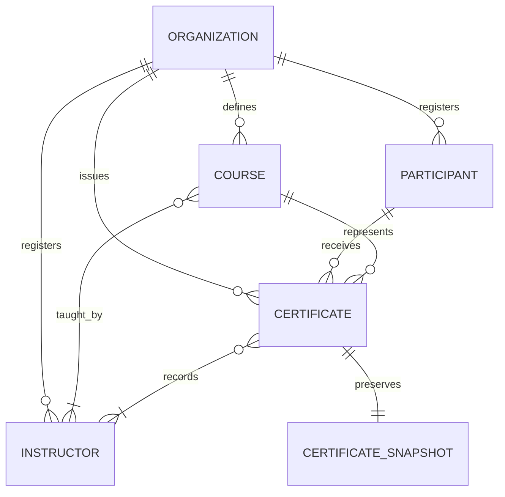

# Initial Domain Model

## Purpose

This document defines the initial domain model of Certify Studio.

Its purpose is to describe the main business concepts, their responsibilities, attributes, and relationships before implementing persistence with JPA and a relational database.

The model initially focuses on the individual certificate issuance flow defined for MVP v0.1.0.

## Modeling principles

- The domain model represents business concepts, not database tables.
- Each entity must have a clear responsibility.
- Relationships must reflect the certificate issuance process.
- Persistence details will be defined in a later issue.
- A certificate must preserve the data used at the time of issuance.
- Features planned for later versions must not increase the initial MVP scope.

## Security and privacy principles

- Collect only the personal data required for the application's current functionality.
- Treat all participant information as protected data.
- Expose only the minimum participant information required for public certificate validation.
- Public validation codes must be random, unique, and difficult to guess.
- Validate all data received by the application.
- Do not store passwords, tokens, private keys, or other secrets in source code.
- Do not include personal data or secrets in application logs.
- Restrict access to personal data according to user roles and responsibilities.
- Protect data during transmission and storage.
- Record security-relevant operations through audit logs.
- Define retention and deletion rules before storing unnecessary personal data.
- Certificates containing a full CPF must be treated as confidential documents.
- In the complete web mode, certificate generation and download must require authentication and authorization.
- Public certificate validation must not provide access to the original PDF or expose the full CPF.
- The local batch mode must process spreadsheet data without permanent storage and remove temporary files after generation.

## Entities

### Organization

Represents the organization responsible for issuing certificates.

#### Responsibilities

- Identify the certificate issuer.
- Provide the issuer information displayed on certificates.
- Own the participants, courses, instructors, and certificates managed by the application.

#### Initial attributes

| Attribute | Description |
| --- | --- |
| `id` | Unique identifier of the organization. |
| `name` | Public name displayed as the certificate issuer. |
| `legalName` | Registered legal name of the organization. |
| `documentNumber` | Registration or tax identification number of the organization. |

### Participant

Represents a person who participates in a course and may receive certificates.

#### Responsibilities

- Identify the person who completed a course.
- Store only the participant information required for certificate issuance.
- Maintain the participant's association with issued certificates.
- Protect the participant's personal information from unauthorized access or exposure.

#### Initial attributes

| Attribute | Description |
| --- | --- |
| `id` | Unique internal identifier of the participant. |
| `fullName` | Participant's current full name. |
| `cpf` | Required Brazilian individual taxpayer identifier used to identify the participant. The full value is included in the privately delivered certificate but must not be exposed through public validation, URLs, QR codes, logs, or filenames. |

### Course

Represents a course for which the organization may issue certificates.

#### Responsibilities

- Define the course presented on issued certificates.
- Store the standard workload and program content of the course.
- Associate the course with its responsible organization and instructors.

#### Initial attributes

| Attribute | Description |
| --- | --- |
| `id` | Unique identifier of the course. |
| `name` | Name displayed on certificates. |
| `description` | Brief description of the course and its purpose. |
| `workloadHours` | Standard course workload expressed in hours. |
| `programContent` | Topics and subjects covered by the course. |

### Instructor

Represents a professional responsible for teaching or supervising a course.

#### Responsibilities

- Identify the professional responsible for the course.
- Provide the instructor information displayed on certificates.
- Maintain the instructor's association with courses.

#### Initial attributes

| Attribute | Description |
| --- | --- |
| `id` | Unique identifier of the instructor. |
| `fullName` | Instructor's full name displayed on certificates. |
| `professionalTitle` | Professional role or qualification displayed with the instructor's name. |

### Certificate

Represents the historical record of a certificate issued by an organization to a participant for completing a course.

#### Responsibilities

- Record the issuance of a certificate.
- Associate the issuer, participant, course, and instructors.
- Preserve the information used when the certificate was issued.
- Support private PDF generation and download.
- Support optional public validation in the complete web mode.

#### Initial attributes

| Attribute | Description |
| --- | --- |
| `id` | Unique internal identifier of the certificate. |
| `issuedAt` | Date and time when the certificate was issued. |
| `completionDate` | Date on which the participant completed the course. |
| `status` | Current certificate status, initially `ISSUED` or `REVOKED`. |
| `validationCode` | Optional random and unpredictable code used for public validation in the complete web mode. |
| `snapshot` | Immutable copy of the certificate data at the time of issuance. |

#### Certificate snapshot

The snapshot preserves the exact information used to generate the certificate, even if the related entities are changed later.

It initially contains:

| Attribute | Description |
| --- | --- |
| `organizationName` | Name of the issuing organization at issuance time. |
| `participantFullName` | Participant's full name at issuance time. |
| `participantCpf` | Participant's full CPF included in the confidential certificate. |
| `courseName` | Course name at issuance time. |
| `workloadHours` | Course workload at issuance time. |
| `programContent` | Course program content at issuance time. |
| `instructorNames` | Names and professional titles of the instructors at issuance time. |

## Relationships

| Source | Cardinality | Target | Description |
| --- | --- | --- | --- |
| `Organization` | one to zero or many | `Participant` | An organization may register multiple participants, while each participant belongs to one organization. |
| `Organization` | one to zero or many | `Course` | An organization may define multiple courses, while each course belongs to one organization. |
| `Organization` | one to zero or many | `Instructor` | An organization may register multiple instructors, while each instructor belongs to one organization. |
| `Organization` | one to zero or many | `Certificate` | An organization may issue multiple certificates, while each certificate belongs to one issuing organization. |
| `Participant` | one to zero or many | `Certificate` | A participant may receive multiple certificates, while each certificate belongs to one participant. |
| `Course` | one to zero or many | `Certificate` | A course may appear in multiple certificates, while each certificate refers to one course. |
| `Course` | one or more to zero or many | `Instructor` | A course has one or more instructors, while an instructor may teach zero or many courses. |
| `Certificate` | one or more to zero or many | `Instructor` | A certificate records one or more instructors, while an instructor may be associated with zero or many certificates. |

### Relationship and snapshot distinction

Entity relationships represent the current registered data and allow the application to navigate between business concepts.

The certificate snapshot represents the historical data used at issuance time. Changes to an organization, participant, course, or instructor must not modify a previously issued certificate snapshot.

## Supported issuance modes

| Mode | Description | Persistence | Authentication | Public validation |
| --- | --- | --- | --- | --- |
| Complete web mode | Manages participants, courses, instructors, certificates, downloads, and issuance history. | Permanent database storage. | Required. | Optional validation using a random public code. |
| Local batch mode | Reads essential data from an Excel spreadsheet and generates multiple certificates locally. | No permanent storage. Temporary files must be removed after generation. | Not required because processing occurs locally. | Not available by default. |

Both modes must use the same certificate generation rules to avoid duplicated business logic.

The complete web mode obtains certificate data from registered entities. The local batch mode creates the required domain data temporarily from the spreadsheet.

## Domain model diagram

`CertificateSnapshot` is represented separately in the diagram for clarity, but it is a value object owned by `Certificate`, not an independent entity.

## Initial assumptions and decisions

- Every participant, course, instructor, and certificate belongs to one organization in the complete web mode.
- A participant's full name and CPF are required for certificate issuance.
- A participant's CPF must be valid and unique within the organization.
- A certificate displays the participant's full CPF and must therefore be treated as a confidential document.
- The original certificate PDF must not be available through public validation.
- Public validation must expose only the minimum information required to confirm authenticity.
- A certificate refers to exactly one participant, one course, and one issuing organization.
- A certificate records one or more instructors.
- The certificate snapshot is immutable after issuance.
- Changes to registered entities must not change previously issued certificate snapshots.
- The public validation code is optional and exists only in modes that support public validation.
- The local batch mode does not require authentication because it runs locally and does not permanently store spreadsheet data.
- Database mappings, Java types, JPA annotations, migrations, and repository implementations are outside the scope of this document.
